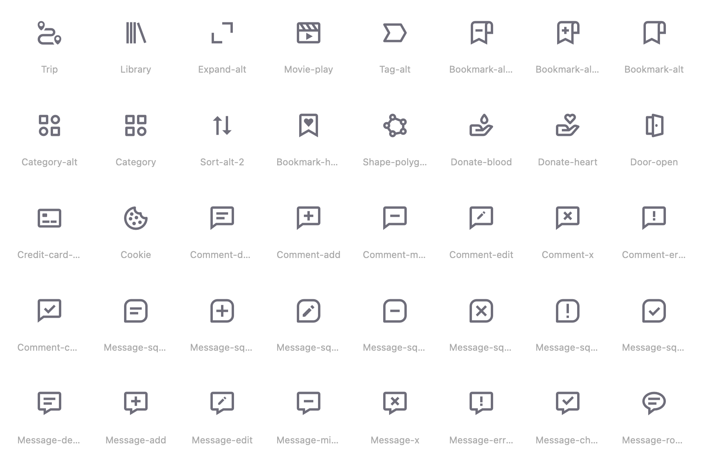
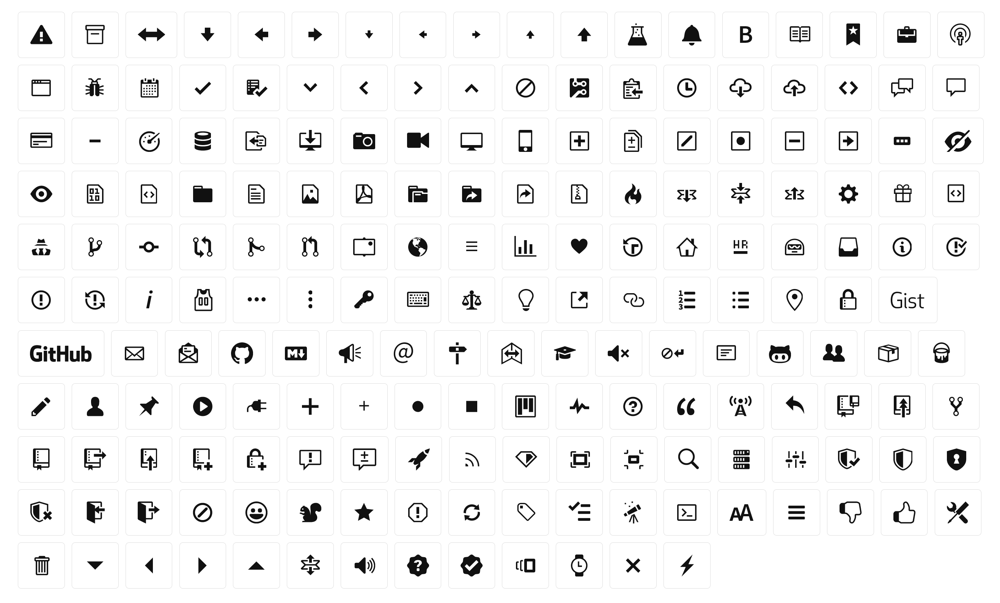
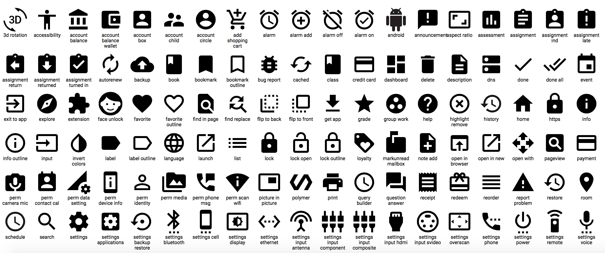
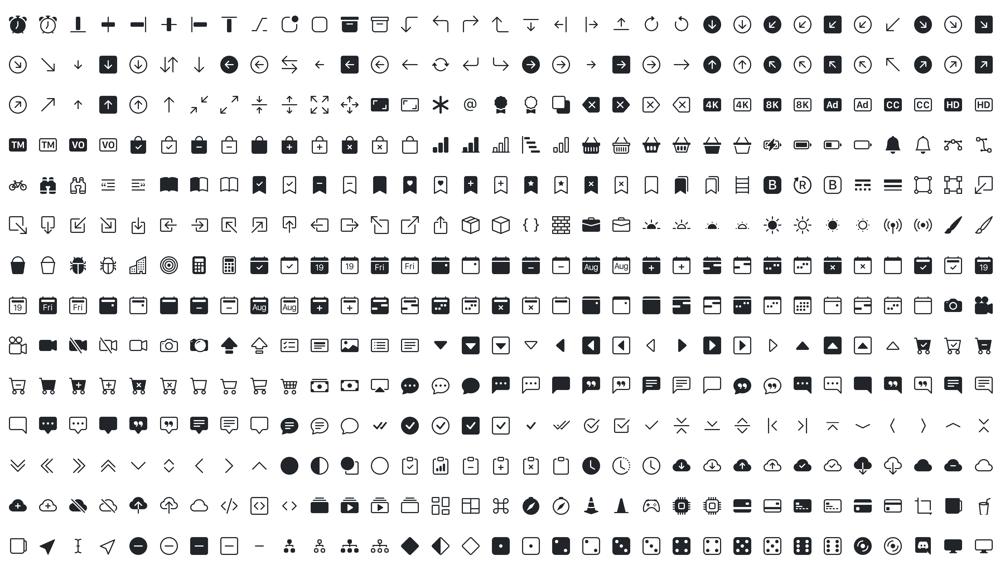
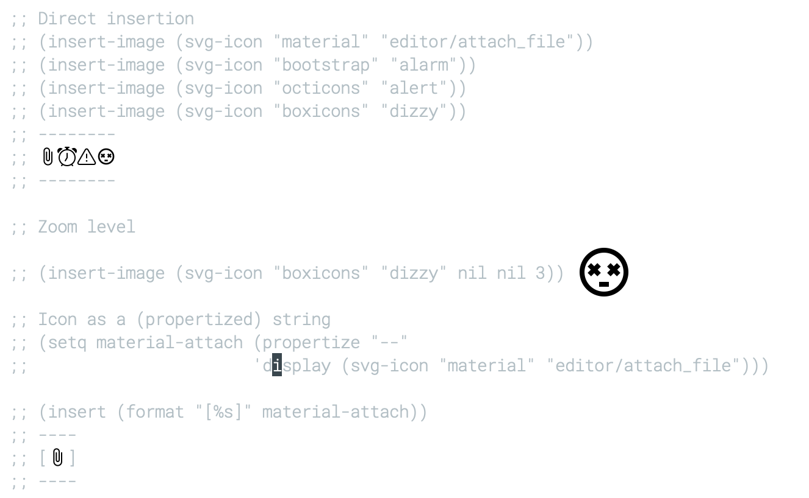

### Introduction

This library allows to create svg icons by parsing remote collections
whose license are compatibles with GNU Emacs:

- [Boxicons](https://github.com/atisawd/boxicons), available under a
  Creative Commons 4.0 license.  As of version 2.07 (December 2020),
  this collection offers 1500 icons in two styles (regular & solid).
  Browse [gallery](https://boxicons.com)
  
  
  

- [Octicons](https://github.com/primer/octicons), available under a
  MIT License with some usage restriction for the GitHub logo.  As of
  version 11.2.0 (December 2020), this collection offers 201 icons.
  [Browse gallery](https://primer.style/octicons)
  
  

- [Material](https://github.com/Templarian/MaterialDesign),
  available under an Apache 2.0 license.  As of version 4.0.0
  (December 2020), this collection offers 500+ icons in 4 styles
  (filled, outlined, rounded, sharp).
  Browse [gallery](https://materialdesignicons.com)

  

- [Bootstrap](https://github.com/twbs/icons), available under an MIT
  license.  As of version 1.2.1 (December 2020), this collection
  offers 1200+ icons in 2 styles (regular & filled). Browse
  [gallery](https://icons.getbootstrap.com)

  

The default size of an icon is exactly 2x1 characters such that it
can be inserted inside a text without disturbing alignment.

Note: Each icon is cached locally to speed-up loading the next time
      you use it. If for some reason the cache is corrupted you can
      force reload using the svg-icon-get-data function.

If you want to add new collections (i.e. URL), make sure the icons
are monochrome and that their size are consistent.


### Usage

```lisp
;; Direct insertion
(insert-image (svg-icon "material" "attachment"))
(insert-image (svg-icon "bootstrap" "alarm"))
(insert-image (svg-icon "octicons" "alert"))
(insert-image (svg-icon "boxicons" "dizzy"))

;; Defining a "string icon"
(setq material-attach (propertize "--"
                      'display (svg-icon "material" "attachment")))

(insert (format "[%s]" material-attach))
```

**Output**


